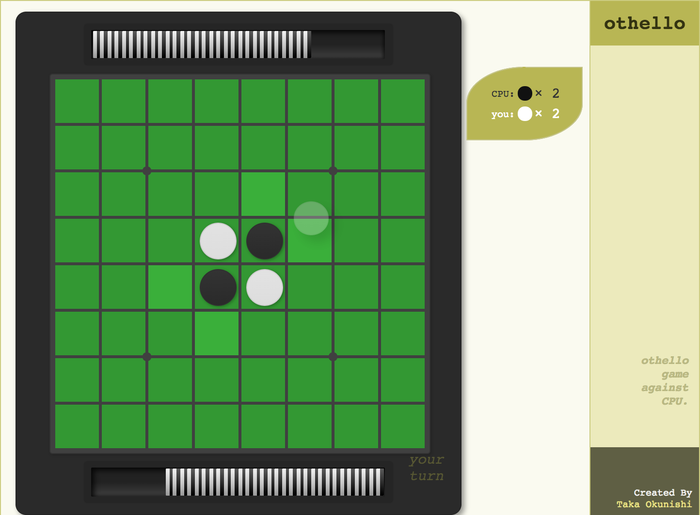

OthelloTek
==========

A othello game written in JavaScript.

Open the index.html with a browser and the game will begin.

[OthelloTek]: http://okunishinishi.github.io/OthelloTek/

## [Play it now!][OthelloTek]

[][OthelloTek]

Donation
-------

[gittip-okunishinishi]: https://www.gittip.com/okunishinishi/

Support this project and [others by okunishinishi][gittip-okunishinishi] via [gittip][gittip-okunishinishi].

[][gittip-okunishinishi]

License
-------
This software is released under the [MIT License](https://raw.github.com/okunishinishi/OthelloTek/master/LICENSE).
